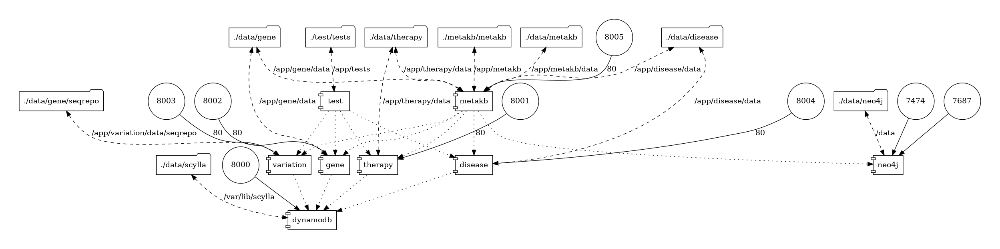

# Compose services for metakb

> Runs metakb services in containers using docker compose.

## Overview




## Installation

You will need [docker-compose](https://docs.docker.com/compose/install/)


## Quickstart

### After cloning this repo, you will need to clone metakb services.

At this time, we only have one: `therapy-normalizer`

```
cd compose

git clone https://github.com/cancervariants/therapy-normalization
cd therapy-normalization
# Dockerfile currently on this branch
git checkout issue-123

cd ..
```

### Configure

All environmental variables necessary are maintained in a `.env` file you need to create in the project root folder.  This file is not maintained in git.  See `dot-env-example.txt`

You will need to clone services repositories.

```
git clone https://github.com/cancervariants/disease-normalization
git clone https://github.com/cancervariants/gene-normalization
git clone https://github.com/cancervariants/therapy-normalization
git clone https://github.com/cancervariants/variant-normalization
```


### Launch

```
# build services
docker-compose build

# launch all services in the background
docker-compose up -d
```

### Data dependencies

* Therapy
```
dc exec therapy sh -c "pipenv run python3 -m therapy.cli --normalizer=\"rxnorm chemidplus ncit wikidata chembl\"  --update_merged "
```

* Gene

We run seqrepo as a separate step outside of the gene normalizer container:

  * See https://github.com/biocommons/biocommons.seqrepo/blob/main/docs/docker.rst#tips

  * https://github.com/biocommons/biocommons.seqrepo/blob/main/docs/mirror.rst#fetching-using-rsync-manually

  * https://github.com/cancervariants/gene-normalization#installation


```
docker run --user $(id -u):$(id -g) -v $(pwd)/data/gene/seqrepo:/usr/local/share/seqrepo biocommons/seqrepo seqrepo pull -i 2020-11-27

# at least on a mac, this step is necessary to rename rsync's temp dir
# something seems to be removing write permissions from the temp dir?
# dr-xr-xr-x
sudo mv 2020-11-27.jqflq35k 2020-11-27

```

After running seqrepo, start the gene normalizer via `dc up -d gene`

Then harvest genes.

```
dc exec gene sh -c "pipenv run python3 -m gene.cli --update_all"
```


* Variant

```
#
# Variant normalizer will read from variant/data/seqrepo/latest
# so, in the host os, navigate to data/gene/seqrepo and `ln -s`
#
ln -s  2020-11-27 latest
#
# then, in docker compose, we map the seqrepo we setup for gene to the variant container
# `- ./data/gene/seqrepo:/app/variant/data/seqrepo`
#
```

* Disease

```

dc exec disease sh -c "pipenv run python3 -m  disease.cli  --normalizer \"ncit mondo do oncotree\" --update_merged"
```


### Test

* Services should be up and running
```
$docker-compose ps
disease    /bin/sh -c pipenv run uvic ...   Up (healthy)   0.0.0.0:8004->80/tcp
dynamodb   /docker-entrypoint.py --sm ...   Up             10000/tcp, 22/tcp, 7000/tcp, 7001/tcp, 0.0.0.0:8000->8000/tcp, 9042/tcp, 9160/tcp, 9180/tcp
gene       /bin/sh -c pipenv run uvic ...   Up (healthy)   0.0.0.0:8002->80/tcp
test       /bin/sh -c tail -f /dev/null     Up
therapy    /bin/sh -c pipenv run uvic ...   Up (healthy)   0.0.0.0:8001->80/tcp
variant    /bin/sh -c pipenv run uvic ...   Up (healthy)   0.0.0.0:8003->80/tcp
```


* You should see dynamo datastore

If using local dynamodb:

```
ls -l data/dynamodb/shared-local-instance.db

-rw-r--r--  1 xxxx  yyyy  24576 Mar 24 09:21 data/dynamodb/shared-local-instance.db
```

If using scylladb:

```
ls -l data/scylla/
total 0
drwxr-xr-x  34 xxxx  yyyy  1088 Apr  7 23:37 commitlog
drwxr-xr-x  12 xxxx  yyyy   384 Apr  7 18:27 data
drwxr-xr-x   3 xxxx  yyyy    96 Mar 26 07:46 hints
drwxr-xr-x   3 xxxx  yyyy    96 Mar 26 07:46 view_hints
```

* Container /app/<package>/data is mapped to ./data in the host.  After running etl you can see the data dependencies
```
du -sh ./data/*
756M	./data/disease
681M	./data/dynamodb
 14G	./data/gene
1.5G	./data/scylla
 20G	./data/therapy
 38M	./data/variant
```


* You can run high level integration "smoke-tests"

```
# simple smoke tests; [test_server_alive, test_swagger_ui, test_query] 
docker-compose  exec test sh -c "pipenv run pytest  tests/integration"

tests/integration/test_disease.py ...
tests/integration/test_gene.py ...
tests/integration/test_therapy.py ...
tests/integration/test_variant.py ...

```

### Backup scylladb

```
# see https://docs.scylladb.com/operating-scylla/procedures/backup-restore/backup/
# save schema
cqlsh -e "DESC SCHEMA;" > /var/lib/scylla/data/backup/db_schema.cql

# backup keystores
cqlsh --execute="DESCRIBE keyspaces;" | python3 -c "import sys;[print(f'nodetool snapshot  {keystore}') for keystore in sys.stdin.read().split() if 'system' not in keystore]; " | sh
```

### Generate documentation image

Following command will create docker-compose.png

```
docker run --rm -it --name dcv -v $(pwd):/input pmsipilot/docker-compose-viz render -m image docker-compose.yml
```


### Shutdown

```
docker-compose down

# if you wish to remove any volumes
# docker-compose down -v

```
